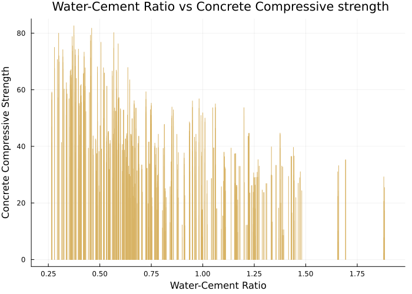

# Abstract

Using a data set covering the concrete compressive strength of a variety of different mixture components, we are going to create a machine learning program that will be able to predict when concrete failures will occur, which components and the combinations of these components will work best based on strength requirements of certain structures, and predict maximum allowable loads that can be achieved based on the mixtures.

This project aims at studying the behavior of various ingredients on the strength of concrete. 

Using these future trends, we will we be able to reach certain conclusions on the future improvements, designs, and materials that should be used in certain structures that we will be able to present to individuals in the fields that use these structures. They then can use these recommendations in their future projects. We will be using the data set of "Concrete Compressive Strength" which was obtained using Kaggle.com [@{https://www.kaggle.com/datasets/sinamhd9/concrete-comprehensive-strength}]. The data comes in the form of an excel file and We will compile all of the data into specific tables and use them to create the future trends we stated above.  

We will be creating new tables and figures that will be of comparisons of when the concrete fails vs the concrete material, strength of concrete vs water to cement ratio, concrete composition vs concrete strength, max allowable loads vs concrete material, max allowable loads vs concrete permutations. In future we will be adding cost of components as new dimension and check out what’s the best and minimal combination to make it cost effective and compare the cost and strength graph.
 
We intend to use Julia to compile these new tables using machine learning tools that can be used to predict permutations, concrete to water ratios etc, that are not specifically included within the data set so we can accurately predict these unknown values that can then be used to run theoretical tests in real life construction project scenarios.

# Exploratory Data Analysis

In this section, we aim to explain the various components in our dataset and it's effect on the concrete compressive strength.

The data set is composed of nine columns of data that state the following information: Fly Ash, Water, Superplasticizer, Coarse Aggregate, Age, and Concrete Compressive Strength. These columns have the following units of measurements: the first 7 columns have the units kg in m^3 mixture, 8th column in days and the 9th column in MPa megapascals. The data set[@{https://www.kaggle.com/datasets/sinamhd9/concrete-comprehensive-strength}] is in a CSV format and has a total of 1030 rows. We found a few discrepancies in the data set and we had to perform some data cleaning tasks before doing any exploratory analysis. The below section describes our data cleaning process in detail.

## Data Cleaning
The dataset that we selected from Kaggle comprised of rows that had rows that were repeated multiple times. In order to remove the redundancy, we used the `unique()` function to remove the duplicate rows. The number of rows reduced to 1005 after this operation.

The other issue we found out in our dataset was that the compressive strength was different despite all the factors affecting it i.e. all the 8 columns affecting it were exactly the same. We combined those rows in to a single row by taking a mean of the compressive strength. After this operation, the number of rows in our dataset reduced to 992.

We also observed that one of the columns i.e. fine aggregate had an extra space in it's name and we had to remove the extra space using the `rename()` method to make the column access easier.

```julia
begin
df_orig = CSV.read("/Users/kanchankulhalli/Documents/CEE 492 - Data Science/concrete_data.csv", DataFrame)
df_uniq = unique(df_orig)
rename!(df_uniq, :"fine_aggregate " => :fine_aggregate)
df_group = groupby(df_uniq, [:cement, :blast_furnace_slag, :fly_ash, :water, :superplasticizer, :coarse_aggregate, :fine_aggregate, :age])
df = combine(df_group, :concrete_compressive_strength => mean)
rename!(df, :concrete_compressive_strength_mean => :concrete_compressive_strength)
end
```


## Description of the Dataset

Now that we cleaned our dataset, we set out to ask some interesting questions and studying each column and its effect on concrete compressive strength but before we did that, we generated Table @tbl:table-1 to get a general understanding of the columns in our dataset.

|   |               variable              |  min  |   mean  |  median | max    |
|:-:|:-----------------------------------:|:-----:|:-------:|:-------:|--------|
|   |                Symbol               |  Real | Float64 | Float64 |  Real  |
| 1 | :cement(kg per m3)                  | 102.0 | 276.873 | 259.95  | 540.0  |
| 2 | :blast_furnace_slag(kg per m3)      | 1.0   | 73.0007 | 20.0    | 359.4  |
| 3 | :fly_ash(kg per m3)                 | 1.0   | 55.6028 | 1.0     | 200.1  |
| 4 | :water(kg per m3)                   | 121.8 | 182.368 | 185.7   | 247.0  |
| 5 | :superplasticizer(kg per m3)        | 1.0   | 6.34415 | 6.0     | 32.2   |
| 6 | :coarse_aggregate(kg per m3)        | 801.0 | 974.597 | 968.0   | 1145.0 |
| 7 | :fine_aggregate(kg per m3)          | 594.0 | 773.081 | 780.0   | 992.6  |
| 8 | :age(days)                          | 1     | 46.1663 | 28.0    | 365    |
| 9 | :concrete_compressive_strength(MPa) | 2.33  | 35.119  | 33.73   | 82.6   |

Table: Ranges and statistics of the columns in our dataset. {#tbl:table-1}

Water and Cement are the two most basic ingredients of concrete. The strength of the concrete mixture is heavily influenced by the proportions of these ingredients. We decided to take a look at how the water/cement ratio affects the strength of the concrete.

### Water and Cement
The Abrams’ water-to-cement ratio (w/c) pronouncement of 1918 has been described as the most useful and significant advancement in the history of concrete technology. His most important formulation was the inverse proportionality between the w/c ratio and the strength of concrete. The generally accepted Abrams rule is a formulation of the observation that an increase in the w/c decreases 

We decided to check how the Abrams' law holds up for our dataset considering the fact that there are several other ingredients that affect the strength of the concrete. Figure @fig:plot-1 plots the water cement ratio versus the concrete compressive strength. 


{#fig:plot-1}

We can observe that the law holds quite good from a general perspective i.e. the compressive strengths decreases with the increase in the w/c ratio but doesn't hold true on a case by case basis. This is understandable since there are a number of other factors that also influnce the strength.

 In the below sub sections, we try to analyze the effects of various other ingredients on the compressive strength of concrete.

### Blast Furnace Slag


### Fly Ash

In recent years, fly ash has become an increasing common component used in concrete mixtures. Fly ash is used to increase the workability of plastic concretes along with increase the strength and durability of regular concretes (Ondova, 2012). Fly ash can also replace a portion of the amount of cement mixture needed which in return reduces the cost while not decreasing the strength. Using our data set


### Coarse Aggregate and Fine aggregate

### Superplasticizer

### Age

### Concrete Compressive Strength


# Predictive Modeling


