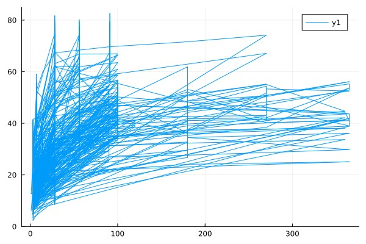

                                            Deliverable #1
Using a data set covering the concrete compressive strength of a variety of different mixture components, we are going to create a machine learning program that will be able to predict when concrete failures will occur, which components and the combinations of these components will work best based on strength requirements of certain structures, and predict maximum allowable loads that can be achieved based on the mixtures  

Using these future trends, we will we be able to reach certain conclusions on the future improvements, designs, and materials that should be used in certain structures that we will be able to present to individuals in the fields that use these structures. They then can use these recommendations in their future projects. We will be using the data set of "Concrete Compressive Strength" which was obtained using Kaggle.com [@{https://www.kaggle.com/datasets/sinamhd9/concrete-comprehensive-strength}]. The data comes in the form of an excel file and We will compile all of the data into specific tables and use them to create the future trends we stated above.  

The data set is composed of nine columns of data that state the following information: Fly Ash component, Water component, Superplasticizer, Coarse Aggregate, Age, and Concrete Compressive Strength. These columns have the following units of measurements: kg in m^3 mixture, kg in m^3 mixture, kg in m^3 mixture, kg in m^3 mixture, kg in m^3 mixture, kg in m^3 mixture, kg in m^3 mixture, days, MPa megapascals. The excel data set has a total of 1030 rows of this data.

We will be creating new tables and figures that will be of comparisons of when the concrete fails vs the concrete material, strength of concrete vs water to cement ratio, concrete composition vs concrete strength, max allowable loads vs concrete material, max allowable loads vs concrete permutations. In future we will be adding cost of components as new dimension and check out what’s the best and minimal combination to make it cost effective and compare the cost and strength graph.
 
We intend to use Julia to compile these new tables using machine learning tools that can be used to predict permutations, concrete to water ratios etc, that are not specifically included within the data set so we can accurately predict these unknown values that can then be used to run theoretical tests in real life construction project scenarios.
                                        Deliverable #2

