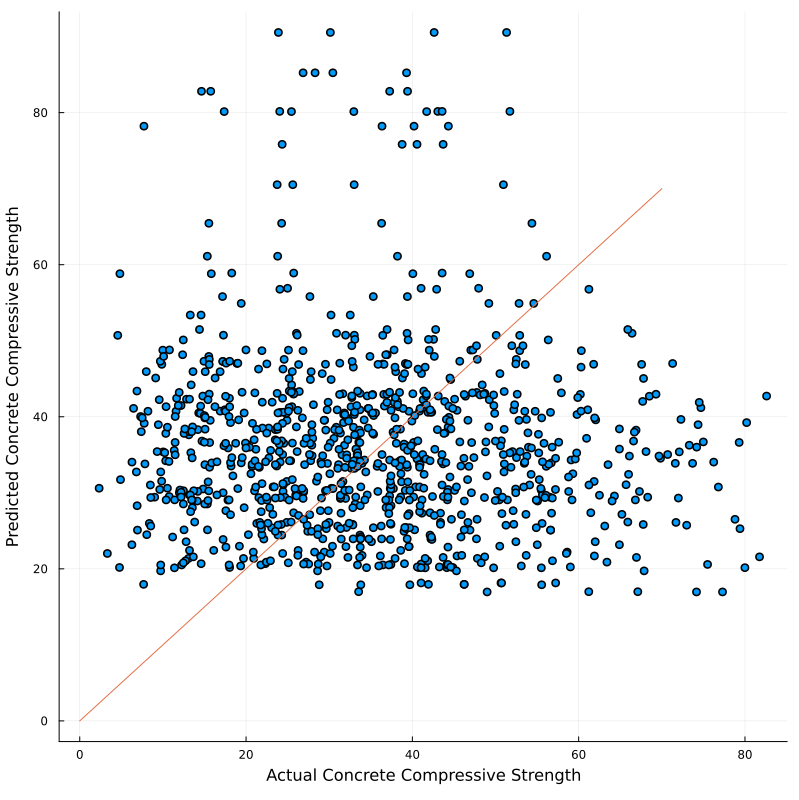

# Report Rough Draft

## Introduction

The aim of our project was to create a machine learning model that would be able to predict which components and the combinations of these components in our data set that covers admixtures of real world concrete projects would work best based on the strength requirements of certain structures and be able to predict maximum allowable loads that can be achieved based on the mixtures. The general research question we were trying to answer was to find out if a machine learning program could predict the best admixture for a construction project to be the most cost efficient for the employers of the project. This is a key part in the construction management field since as a company you always want to mee the project requirements but also make the most profit. Previous work done in this area is creating machine learning programs to estimate the ideal cost for a project based on the materials/labor that is required but we wanted to just focus on concrete admixtures and go in depth in with creating a machine learning model for figuring out the ideal admixtures of different projects.

## Exploratory analysis

For our exploratory analysis, we aimed to explain the various components in our dataset and its effect on the concrete compressive strength.

The data set we chose was composed of nine columns of data that state the following information: Fly Ash, Water, Superplasticizer, Coarse Aggregate, Age, and Concrete Compressive Strength. These columns have the following units of measurements: the first 7 columns have the units kg in m^3 mixture, 8th column in days and the 9th column in MPa megapascals. The data set[@{https://www.kaggle.com/datasets/sinamhd9/concrete-comprehensive-strength}] is in a CSV format and has a total of 1030 rows. We found a few discrepancies in the data set and hence we had to perform some data cleaning tasks before doing any exploratory analysis. The below section describes our data cleaning process in detail.

### Data Cleaning

The dataset that we selected from Kaggle comprised of rows that had rows that were repeated multiple times. To remove the redundancy, we used the `unique()` function to remove the duplicate rows. The number of rows reduced to 1005 after this operation.

The other issue we found out in our dataset was that the compressive strength was different despite all the factors affecting it i.e., all the 8 columns affecting it were the same. We combined those rows into a single row by taking a mean of the compressive strength. After this operation, the number of rows in our dataset reduced to 992.

We also observed that one of the columns i.e., fine aggregate had an extra space in its name and we had to remove the extra space using the `rename()` method to make the column access easier.

```julia
begin
df_orig = CSV.read("/Users/kanchankulhalli/Documents/CEE 492 - Data Science/concrete_data.csv", DataFrame)
df_uniq = unique(df_orig)
rename!(df_uniq, :"fine_aggregate " => :fine_aggregate)
df_group = groupby(df_uniq, [:cement, :blast_furnace_slag, :fly_ash, :water, :superplasticizer, :coarse_aggregate, :fine_aggregate, :age])
df = combine(df_group, :concrete_compressive_strength => mean)
rename!(df, :concrete_compressive_strength_mean => :concrete_compressive_strength)
end
```
Now that we cleaned our dataset, we set out to ask some interesting questions by studying each column and its effect on concrete compressive strength but before we did that, we generated Table @tbl:table-1 to get a general understanding of the columns in our dataset.

|   |               variable              |  min  |   mean  |  median | max    |
|:-:|:-----------------------------------:|:-----:|:-------:|:-------:|--------|
|   |                Symbol               |  Real | Float64 | Float64 |  Real  |
| 1 | :cement(kg per m3)                  | 102.0 | 276.873 | 259.95  | 540.0  |
| 2 | :blast_furnace_slag(kg per m3)      | 1.0   | 73.0007 | 20.0    | 359.4  |
| 3 | :fly_ash(kg per m3)                 | 1.0   | 55.6028 | 1.0     | 200.1  |
| 4 | :water(kg per m3)                   | 121.8 | 182.368 | 185.7   | 247.0  |
| 5 | :superplasticizer(kg per m3)        | 1.0   | 6.34415 | 6.0     | 32.2   |
| 6 | :coarse_aggregate(kg per m3)        | 801.0 | 974.597 | 968.0   | 1145.0 |
| 7 | :fine_aggregate(kg per m3)          | 594.0 | 773.081 | 780.0   | 992.6  |
| 8 | :age(days)                          | 1     | 46.1663 | 28.0    | 365    |
| 9 | :concrete_compressive_strength(MPa) | 2.33  | 35.119  | 33.73   | 82.6   |

Table: Ranges and statistics of the columns in our dataset. {#tbl:table-1 height=2in}

## Predictive modeling

### Regression

Our dataset consists of eight independent variables and one dependent variable. We want to know how each of these independent variables affect the dependent variable i.e. concrete compressive strength. To begin with, we checked if these independent variables affect the concrete strength linearly by implementing a simple linear regression model.

We first divided our data into two sets (i) training data set (ii) testing data set. The training data set consists of 750 rows and the testing dataset consists of the remaining 242 rows. So, we split our dataset into training and testing to about 75% and 25% roughly. We didn't split our data set into evaluation dataset since the number of hyperparameters to be tuned for this model were only a few. We set our learning rate to 0.1 and the number of steps to 1000. These hyperparameters are needed for finding the global minima for our cost function which is the mean squared error in our case. We did tune our hyperparameters a bit. However, we didn't see any noticeable improvement in the results. 

Here is a snippet of our model.

```julia
# Linear regression model -> Y = beta.X + C
function minimize!(f_model::Function, x::Matrix{T}, y::Vector{T}, p::Vector{T}, η::T, num_steps::Int)::Vector{T} where T<:AbstractFloat
    f(p) = mse(f_model(x,p),y)
    for i in 1:num_steps
        g = f'(p)
        p -= η * g 
    end
    p
end

function model(x::Matrix{T}, p::Vector{T})::Vector{T} where T<:AbstractFloat
    p1 = p[1:end-1]
    p2 = p[end]
    ŷ = x * p1 .+ p2
end

# Train the model on df_train ~ 750 rows and learn the model parameters beta.
T = Matrix(normalize_df(df_train))
beta = minimize!(model, T, y_train, rand(size(T)[2]+1), 0.1, 1000)

# Use the model parameters(beta) to predict the concrete compressive strength(y_hat)
input_data = Matrix(normalize_df(df_test))
y_hat = model(input_data, beta)

# Calculate the RMSE on the test data.
sqrt(mse(y_hat, y_test))

```

{#fig:linear-reg height=5in}

We got an RMSE ~ 10 for the above model. From Figure @fig:linear-reg, we can see that although a lot of points are closer to the 45 degree line, we can also see that there are a large number of points which deviate from the line quite a bit. This can suggest a few things

* The model has overfitted on the training data and is performing poorly on the testing data.
* The dependency of the independent variables cannot be modeled linearly and hence we may need a more complex model like a neural network.
* Our dataset comprises of only 8 variables that affect the concrete compressive strength. There may be many other factors that affect the strength which is clearly a limitation of the dataset. From [@{https://theconstructor.org/concrete/factors-affecting-strength-of-concrete/6220/}], we can see that the compressive strength of concrete is also dependent on temperature, humidity and curing among many other factors.

To follow this up, we implemented logistic regression model and the multilayered regression model (neural network) to see if we can make any significant improvements. However, we found the RMSE to be around 34 for both the models. This was very surprising since we expected the non-linear models to perform better. Hence, we decided not to plot them. 

### Regression Conclusions

* To understand why our linear regression model performs badly, we checked if we overfitted the model on the training data. However, the RMSE on the training data and the testing data are almost the same and hence we haven't really overfitted the model.
* We will continue to explore why our neural network models performed so poorly and hope we can find a convincing answer by the next deadline. One of the plausible reasons could be that we haven't done any regularization. Although, we realized that our model hasn't really overfitted but it would be a good idea to try this out for the future.
* We could try and implement a stochastic gradient descent algorithm and verify if that improves our model.

### Decision Tree

Following our regression model, we tried using the decision tree method in Julia to create a predictive model of our data using a regression tree made out of our data since our dataset is considered to be non-linear. To start, we split up our cleaned data into independent variables (the concrete admixtures, XXX) and dependent variables (the concrete compressive strength, XX) that would be in the form of a matrix and vector respectfully so they then can be used to create our decision tree.

```julia
  independent = Matrix(XXX),
  dependent = vec(Matrix(XX))
```
We then would build our initial tree using our independent and dependent variables using the following code available in the DecisionTree package from Julia.

```julia
init_tree = build_tree(dependent, independent)
```
After our initial tree was created, we then tried using the print_tree function to visualize what our initial tree looked like in terms of values as seen below. However, this returned only the tree in numerical form so it was hard to visualize. 

```julia
print_tree(init_tree)
```
This led to us needing to research online how to plot the decision tree we made and ended up using the "EvoTrees", "MLJ", and "MLJModels" packages in Julia that led to us to being able to produce the following plot our initial decision tree that used our unaltered independent and dependent variables from our dataset.

```julia
config = EvoTreeRegressor(
    loss=:linear, 
    nrounds=100, 
    nbins=100,
    lambda=0.5, 
    gamma=0.1, 
    eta=0.1,
    max_depth=6, 
    min_weight=1.0,
    rowsample=0.5, 
    colsample=1.0)
    x_train = independent
    y_train = dependent
mmm = fit_evotree(config; x_train, y_train)
Unaltered = Plots.plot(mmm,2, size=(1800,1800))
```
Using the code above we were able to successfully plot our initial decision tree as seen below.

{#fig:plot-10 height=5in}

We then used the following code which ran a cross validation of our inputs we are using based on the number of n-folds we had chose, which we chose 5 for our data set since using more than this did not change the accuracy and using less than this lowered the accuracy. All the other variables used in this function we set as the default values the function used since only changing the pruning purity affected the accuracy. However changing the value only lowered the accuracy since it could only be a value from 0 to 1 and having a value of 1 seemingly gave the highest accuracy.

```julia
n_folds = 5
n_subfeatures = 0; max_depth = -1; min_samples_leaf = 10
min_samples_split = 2; min_purity_increase = 0.0; pruning_purity = 1.0 ; seed=3
accuracyy= nfoldCV_tree(dependent, independent, n_folds, pruning_purity, max_depth, min_samples_leaf, min_samples_split, min_purity_increase; verbose = true, rng = seed) 

output = 
Mean Coeff of Determination: 0.7863928687545627
5-element Vector{Float64}:
 0.8169979801378208
 0.817157085939846
 0.7354379123502578
 0.8112046184837071
 0.7511667468611821
```
We see that the average accuracy of our initial decision tree is 78.6%. To increase the accuracy, we then ran our independent and dependent variables through another build tree function but now using the default sub_features that we used in our "accuracyy" function from earlier. We then take this new decision tree and run it through the "apply_tree" function to create a new vector of our dependent variables. Which we then can use to compare to our initial dependent variables vector. Then we can check the accuracy of this with our new dependent variable vector compared to our original and we see that we now have an average accuracy of 90.9%

```julia
new_init_tree = build_tree(dependent, independent, n_subfeatures, max_depth, min_samples_leaf, min_samples_split, min_purity_increase; rng = seed)

new_dependent_vector = apply_tree(mnn, independent)

accuracyyy= nfoldCV_tree(new_dependent_vector, independent, n_folds, pruning_purity, max_depth, min_samples_leaf, min_samples_split, min_purity_increase; verbose = true, rng = seed) 

output = 
Mean Coeff of Determination: 0.9094893339292118
5-element Vector{Float64}:
 0.9242267026779262
 0.911504737742548
 0.8489222674442972
 0.9591954741485458
 0.9035974876327418
```
We then plotted this new decision tree the same way as what we did for the first one and it produced the following.

{#fig:plot-11 height=5in}

Lastly, to see how the original dependent variables vector and the new dependent variables vector compare after running it through the decision trees machine learning method we made the following scatter plot to show how the two relate and the we see that the best fit line fits approximately 75% of the points on the plot seen below

{#fig:plot-12 height=5in}

Lastly, we can see how the gini-impurtity has changed after running our dependent variable vector through the decision tree and we see that they are very close to being the same value which means that our decision trees above are very similar which means our machine learning made an accurate prediction.

```julia

function gini_impurity(y::AbstractVector)
    ig = 1.0
    println(y)
    u = unique(y)
    for c in u 
        p = mean(c .== y)^2
        ig -= p
    end

gini_impurity(sw)
gini_impurity(dependent)

output =
0.9865130723205006
0.9986078141259189
```
### Decision Tree Conclusions

The decision tree method overall seemed like a viable option to create a draft predictive model for our data set and we intend to refine our trees to be used later on. What we can do to potentially make our decision tree method better is to find a way to prune the decision tree more effectively or find a way to split our data set better so that or accuracy is higher. We also could potentially refine our gini-impurity so that the data set has less inequality.

## Discussion 

After creating two predictive machine learning models of our data set in our predictive modeling section, we concluded that our initial research question was able to be accomplished with relative accuracy. However, our initial idea of how our machine learning program would work was very different from what we had originally in mind. We thought that we would be able to insert a constraint, such as 20 MPa for the concrete compressive strength, and it would give us the admixture combination that came closes to this. However, since our data set set was only composed of a category of admixures, we were unable to get it to only return one value and instead it would return many rows of data. Another issue with our data set was that since it was a category, we were unable to get any other machine learning options we learned in class besides a simple non-linear regression and decision tree to work. Which led to us not being able to have our predictive model to result in great accuracy, above 95%, leading to our program to not be reliable if we were to use it in a real world scenario. The next steps that would could take is to find a better data set for this topic we chose or create our own data set that provided the exact impacts that each concrete component contributed to the concretes compressive strength. We then would be able to use this new data set we created and normalize, run through dense layers, and used neural network programming to create a much better predictive model that could then be applied in real world concrete management projects.


{#fig:plot-11 height=5in}

