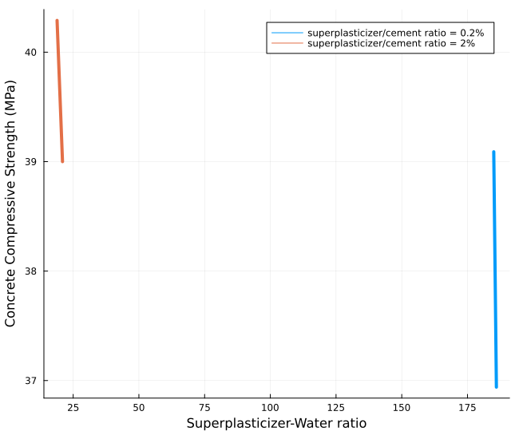
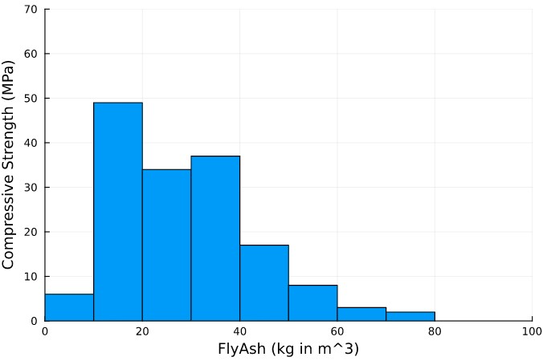
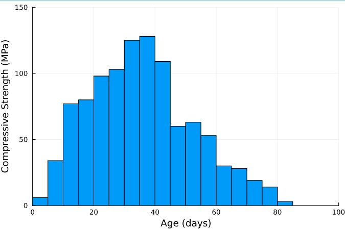

# Abstract

This project aims to create a machine learning model that will be able to predict which components and the combinations of these components will work best based on strength requirements of certain structures and predict maximum allowable loads that can be achieved based on the mixtures. We also plan to create a model to predict the most cost effective concrete mixture.

The dataset on "Concrete Compressive Strength" was obtained using Kaggle.com [@{https://www.kaggle.com/datasets/sinamhd9/concrete-comprehensive-strength}]. The data comes in a CSV format and contains 9 columns and a total of 1032 rows. The next section gives a detailed information on the dataset.

As the first step, we have done an extensive exploratory analysis on our dataset. We have studied the effects of all the different columns(the independent variables) on concrete compressive strength(the dependent variable). Most of the plots have been quite intuitive while some of the plot haven't provided much information on how exactly they impact the concrete compressive strength.

The final section contains an overview on how we plan on generating the machine learning models to predict the concrete compressive strengths based on different mixture composition. 


# Exploratory Data Analysis

In this section, we aim to explain the various components in our dataset and its effect on the concrete compressive strength.

The data set is composed of nine columns of data that state the following information: Fly Ash, Water, Superplasticizer, Coarse Aggregate, Age, and Concrete Compressive Strength. These columns have the following units of measurements: the first 7 columns have the units kg in m^3 mixture, 8th column in days and the 9th column in MPa megapascals. The data set[@{https://www.kaggle.com/datasets/sinamhd9/concrete-comprehensive-strength}] is in a CSV format and has a total of 1030 rows. We found a few discrepancies in the data set and hence we had to perform some data cleaning tasks before doing any exploratory analysis. The below section describes our data cleaning process in detail.

## Data Cleaning
The dataset that we selected from Kaggle comprised of rows that had rows that were repeated multiple times. To remove the redundancy, we used the `unique()` function to remove the duplicate rows. The number of rows reduced to 1005 after this operation.

The other issue we found out in our dataset was that the compressive strength was different despite all the factors affecting it i.e., all the 8 columns affecting it were the same. We combined those rows into a single row by taking a mean of the compressive strength. After this operation, the number of rows in our dataset reduced to 992.

We also observed that one of the columns i.e., fine aggregate had an extra space in its name and we had to remove the extra space using the `rename()` method to make the column access easier.

```julia
begin
df_orig = CSV.read("/Users/kanchankulhalli/Documents/CEE 492 - Data Science/concrete_data.csv", DataFrame)
df_uniq = unique(df_orig)
rename!(df_uniq, :"fine_aggregate " => :fine_aggregate)
df_group = groupby(df_uniq, [:cement, :blast_furnace_slag, :fly_ash, :water, :superplasticizer, :coarse_aggregate, :fine_aggregate, :age])
df = combine(df_group, :concrete_compressive_strength => mean)
rename!(df, :concrete_compressive_strength_mean => :concrete_compressive_strength)
end
```


## Description of the Dataset

Now that we cleaned our dataset, we set out to ask some interesting questions by studying each column and its effect on concrete compressive strength but before we did that, we generated Table @tbl:table-1 to get a general understanding of the columns in our dataset.

|   |               variable              |  min  |   mean  |  median | max    |
|:-:|:-----------------------------------:|:-----:|:-------:|:-------:|--------|
|   |                Symbol               |  Real | Float64 | Float64 |  Real  |
| 1 | :cement(kg per m3)                  | 102.0 | 276.873 | 259.95  | 540.0  |
| 2 | :blast_furnace_slag(kg per m3)      | 1.0   | 73.0007 | 20.0    | 359.4  |
| 3 | :fly_ash(kg per m3)                 | 1.0   | 55.6028 | 1.0     | 200.1  |
| 4 | :water(kg per m3)                   | 121.8 | 182.368 | 185.7   | 247.0  |
| 5 | :superplasticizer(kg per m3)        | 1.0   | 6.34415 | 6.0     | 32.2   |
| 6 | :coarse_aggregate(kg per m3)        | 801.0 | 974.597 | 968.0   | 1145.0 |
| 7 | :fine_aggregate(kg per m3)          | 594.0 | 773.081 | 780.0   | 992.6  |
| 8 | :age(days)                          | 1     | 46.1663 | 28.0    | 365    |
| 9 | :concrete_compressive_strength(MPa) | 2.33  | 35.119  | 33.73   | 82.6   |

Table: Ranges and statistics of the columns in our dataset. {#tbl:table-1 height=2in}

Water and Cement are the two most basic ingredients of concrete. The strength of the concrete mixture is heavily influenced by the proportions of these ingredients. We decided to take a look at how the water/cement ratio affects the strength of the concrete.

### Water and Cement
The Abram’s water-to-cement ratio (w/c) pronouncement of 1918 has been described as the most useful and significant advancement in the history of concrete technology.The generally accepted Abrams rule is a formulation of the observation that an increase in the w/c decreases the strength [@{https://www.researchgate.net/publication/222447231_Modeling_of_Strength_of_High-Performance_Concrete_Using_Artificial_Neural_Networks_Cement_and_Concrete_research_2812_1797-1808}].

We decided to check how the Abrams' law holds up for our dataset considering the fact that there are several other ingredients that affect the strength of the concrete. Figure @fig:plot-1 plots the water cement ratio versus the concrete compressive strength. 


{#fig:plot-1 height=2.5in}

We can observe that the law holds quite good from a general perspective i.e., the compressive strength decreases with the increase in the w/c ratio but doesn't hold true on a case by case basis. This is understandable since there are several factors that also influence the strength.

In the below sub sections, we try to analyze the effects of various other ingredients on the compressive strength of concrete.

### Superplasticizer
Superplasticizers are powerful water reducers that enable an increase in the ultimate stress of concrete by decreasing the w/c ratio, a decrease in the cement content while maintaining the same range of strength or workability, an increase in concrete compacity, and other effects [@{https://www.sciencedirect.com/science/article/pii/S0958946512001369}].

An important component of most modern concrete mixes, water reducers improve the workability of wet concrete while decreasing the amount of water used in the mix. Superplasticizers decrease the water-cement ratio while providing such benefits as increased density and improved bond strength.

{#fig:plot-2 height=2.5in}

To study the effect of superplasticizer in isolation, we kept all the other columns constant and compared the varying superplasticizer with the concrete compressive strength. Figure @fig:plot-2 shows the line plots for different samples. It is not clear how the superplasticizer is affecting the strength. We looked through a number of articles and research papers and we found out that the effect of superplasticizers is more pronounced when the ratio of superplasticizer to cement is between 0.5% to 3% [@{http://www.buildingresearch.com.np/newfeatures.php}]. To verify this, we plotted Figure @fig:plot-3 with two samples, the first one has a superplasticizer/cement(s/c) ratio equal to 0.2% and the second one has s/c ratio equal to 2%.

{#fig:plot-3 height=2.5in}

We can see that a decrease in the superplasticizer to water ratio results in decrease in the concrete compressive strength. This suggests a positive correlation between the superplasticizer and the concrete strength. However, for ratios greater than 3%, we did not find any kind of correlation between these two suggesting that the effect of superplasticizer depends on the s/c ratio.


### Fly Ash

In recent decades, fly ash has become an increasing common component used in concrete mixtures. Fly ash is used to increase the workability of plastic concretes along with increase the strength and durability of regular concretes [@doi:10.1016/j.proeng.2012.07.582]. Fly ash can also be used to replace a portion of the amount of the cement mixture needed. This in return reduces the cost while not decreasing the strength. 

Using our data set, we first began by organizing the data set to only include unique values of fly ash since there were many rows that had no fly ash component in their concrete mixture. Then using this data set, we created a histogram to show the general trendline of the imapct that the fly ash component has on the compressive strength. We can see from Figure @fig:plot-4 that using fly ash does increase the strength of the concrete but peaks at approximately 20 kg per m^3 mixture and then decreases as more fly ash is used. This is mostly due to fly ash not being suitable to replace fully or the most of the cement used in the mixture and is used more as a binding unit that helps with the workability and durability to a certain degree.

{#fig:plot-4 height=2.5in}


### Coarse Aggregate and Fine aggregate
Aggregates are inert granular materials such as sand, gravel, or crushed stone that, along with water and Portland cement, are an essential ingredient in concrete. Fine aggregates generally consist of natural sand or crushed stone with most particles passing through a 3/8-inch sieve. Coarse aggregates are any particles greater than 0.19 inch, but generally range between 3/8 and 1.5 inches in diameter [@{https://www.cement.org/cement-concrete/concrete-materials/aggregates}].


{#fig:plot-5 height=2.5in}

We can observe from Figure @fig:plot-5 that there is no positive correlation between the coarse aggregate and the concrete compressive strength. We couldn't really understand how to interpret the graph. Its possible that it's effects weren't pronounced in the samples that we have taken. We need a more refined model to understand the effects of this property.

{#fig:plot-6 height=2.5in}

Figure @fig:plot-6 shows a positive correlation between the fine aggregate and the concrete compressive strength which is as expected. For both the graphs, we have kept all the columns constant except for the column that we are analyzing.


### Age

{#fig:plot-7 height=2.5in}

Figure @fig:plot-7 shows a histogram plot of Age vs Concrete Compressive Strength where age is the number of days after the concrete has been placed, we see that as concrete age increases the compressive strength increases until it reaches a peak at approximately 28 days and then gradually decreases in strength as age increases due to wear and tear of the concrete material. From [@{https://www.sciencedirect.com/science/article/abs/pii/S0008884698001641?via%3Dihub}], we understood that the concrete requires a curing time where once the concrete is placed it needs time to cure which is where the water content in the concrete mixture evaporates, leading to the concrete to settle and harden. This in return leads to increase in the concrete compressive strength. Based on this information and looking at the data set, to have the concrete mixture  result in the strongest compressive strength, we want our age to be around the 28-day mark which is the ideal curing time.


### Blast Furnace Slag

Concretes containing slag as a partial replacement of cement (up to 40%) had higher compressive and flexural strengths casting and curing at +42°C than those of concretes made with Portland cement alone[@doi:10.1016/j.jare.2011.03.004].

{#fig:plot-8 height=2.5in}

However, Figure @fig:plot-8 shows a negative correlation where the compressive strength of the concrete is decreasing with the increase in the Blast furnace slag content. We couldn't really figure out how to interpret this graph and we believe that this similar to the case we explained for coarse aggregate.


### Concrete Compressive Strength

{#fig:plot-9 height=2.5in}

The graph above explains how the proportions of the 8 components are affecting the concrete compressive strength. It clearly shows that the second bar graph has more quantity of superplasticizer and less quantity of water than the first bar graph. Also, the second bar graph has good aging time than the first one. Hence clearly the second plot has more concrete compressive strength than the first one.

# Predictive Modeling
Using our data set, we can create a machine learning model to produce a predictive modeling code for solving for which combinations of concrete mixtures would be ideal to meet a certain strength requirement, based on different construction projects, and then find the minimum optimal cost. To do this we intend to first use the data available in our dataset to find out the unit costs of each component in our concrete. We then will look up research papers over the different strength requirements set in place at the State and Federal level for different construction projects, such as bridges and highways where highway bridges require a minimum of 25 MPa to pass the strength requirements set in place in California [@{https://ascelibrary.org/doi/10.1061/%28ASCE%29CF.1943-5509.0000404}]. 

As a first step towards create a feasible model, we plan to use regression analysis. The reason is that we have 8 independent variables (the 8 columns described in detail in the previous section) affecting the single dependent variable which is the concrete compressive strength. Depending on the results of the model, we plan to explore more advanced machine learning models. We will create rough estimations of how much of each concrete component would need to be used to create the optimal combination for each project. This would be done through the creation of a model of ideal solutions to meet the lowest price and still meet the strength requirements for each unique project. This would be very useful in the construction industry which would be able to use our machine learning models to evaluate which combination of concrete would best work to meet the requirements of their project while also saving the construction company the most capital. 

Based on what we have discussed with the TA, this is a feasible idea since our data could be used to create combinations that are not currently in our dataset by using what we learned in class to create rough estimates of new combinations based on the current data. For example, we could find the new compressive strength of a certain new combination to be the average strength of two known combinations from our data set or use certain criteria found online, such as impact of water to cement ratio or fly ash to concrete ratio, to make a rough estimate of the new combinations results compressive strength. We intend to do this by creating something like the solver function in excel where we will have an objective function, such as minimize price and maximize strength, and set up constraints, such as have strength be greater than or equal to 25 MPa or have at least 20% cement. Then solving this would give us our result of a new matrix of the ideal values for the combinations in the concrete to be used for that specific project.

# Preliminary Predictive Modeling

In this section, we will explore mulitple methods for creating drafts for our predictive modeling analysis. After reviewing the potential methods/algorithms that could be used and discussing in depth with the TA and Professor, we have realized that the methods that would be most ideal for our data set would be the regression method and the decision tree method. We started off with developing a model using linear regression which would be our base model. We have further implemented the decision tree model which shows a great improvement in accuracy.


## Regression
Our dataset consists of eight independent variables and one dependent variable. We want to know how each of these independent variables affect the dependent variable i.e. concrete compressive strength. To begin with, we checked if these independent variables affect the concrete strength linearly by implementing a simple linear regression model.

We first divided our data into two sets (i) training data set (ii) testing data set. The training data set consists of 750 rows and the testing dataset consists of the remaining 242 rows. So, we split our dataset into training and testing to about 75% and 25% roughly. We didn't split our data set into evaluation dataset since the number of hyperparameters to be tuned for this model were only a few. We set our learning rate to 0.1 and the number of steps to 1000. These hyperparameters are needed for finding the global minima for our cost function which is the mean squared error in our case. We did tune our hyperparameters a bit. However, we didn't see any noticeable improvement in the results. 

Here is a snippet of our model.

```julia
# Linear regression model -> Y = beta.X + C
function minimize!(f_model::Function, x::Matrix{T}, y::Vector{T}, p::Vector{T}, η::T, num_steps::Int)::Vector{T} where T<:AbstractFloat
	f(p) = mse(f_model(x,p),y)
	for i in 1:num_steps
		g = f'(p)
		p -= η * g 
	end
	p
end

function model(x::Matrix{T}, p::Vector{T})::Vector{T} where T<:AbstractFloat
	p1 = p[1:end-1]
	p2 = p[end]
	ŷ = x * p1 .+ p2
end

# Train the model on df_train ~ 750 rows and learn the model parameters beta.
T = Matrix(normalize_df(df_train))
beta = minimize!(model, T, y_train, rand(size(T)[2]+1), 0.1, 1000)

# Use the model parameters(beta) to predict the concrete compressive strength(y_hat)
input_data = Matrix(normalize_df(df_test))
y_hat = model(input_data, beta)

# Calculate the RMSE on the test data.
sqrt(mse(y_hat, y_test))

```

{#fig:linear-reg height=5in}


We got an RMSE ~ 10 for the above model. From Figure @fig:linear-reg, we can see that although a lot of points are closer to the 45 degree line, we can also see that there are a large number of points which deviate from the line quite a bit. This can suggest a few things

* The model has overfitted on the training data and is performing poorly on the testing data.
* The dependency of the independent variables cannot be modeled linearly and hence we may need a more complex model like a neural network.
* Our dataset comprises of only 8 variables that affect the concrete compressive strength. There may be many other factors that affect the strength which is clearly a limitation of the dataset. From [@{https://theconstructor.org/concrete/factors-affecting-strength-of-concrete/6220/}], we can see that the compressive strength of concrete is also dependent on temperature, humidity and curing among many other factors.

To follow this up, we implemented logistic regression model and the multilayered regression model (neural network) to see if we can make any significant improvements. However, we found the RMSE to be around 34 for both the models. This was very surprising since we expected the non-linear models to perform better. Hence, we decided not to plot them. 

### Conclusions
* To understand why our linear regression model performs badly, we checked if we overfitted the model on the training data. However, the RMSE on the training data and the testing data are almost the same and hence we haven't really overfitted the model.
* We will continue to explore why our neural network models performed so poorly and hope we can find a convincing answer by the next deadline. One of the plausible reasons could be that we haven't done any regularization. Although, we realized that our model hasn't really overfitted but it would be a good idea to try this out for the future.
* We could try and implement a stochastic gradient descent algorithm and verify if that improves our model.


## Decision Tree

Following our regression model, we tried using the decision tree method in Julia to create a predictive model of our data using a regression tree made out of our data since our dataset is considered to be non-linear. To start, we split up our cleaned data into independent variables (the concrete admixtures, XXX) and dependent variables (the concrete compressive strength, XX) that would be in the form of a matrix and vector respectfully so they then can be used to create our decision tree.

```julia
  independent = Matrix(XXX),
  dependent = vec(Matrix(XX))
```
We then would build our initial tree using our independent and dependent variables using the following code available in the DecisionTree package from Julia.

```julia
init_tree = build_tree(dependent, independent)
```
After our initial tree was created, we then tried using the print_tree function to visualize what our initial tree looked like in terms of values as seen below. However, this returned only the tree in numerical form so it was hard to visualize. 

```julia
print_tree(init_tree)
```
This led to us needing to research online how to plot the decision tree we made and ended up using the "EvoTrees", "MLJ", and "MLJModels" packages in Julia that led to us to being able to produce the following plot our initial decision tree that used our unaltered independent and dependent variables from our dataset.

```julia
config = EvoTreeRegressor(
    loss=:linear, 
    nrounds=100, 
    nbins=100,
    lambda=0.5, 
    gamma=0.1, 
    eta=0.1,
    max_depth=6, 
    min_weight=1.0,
    rowsample=0.5, 
    colsample=1.0)
    x_train = independent
    y_train = dependent
mmm = fit_evotree(config; x_train, y_train)
Unaltered = Plots.plot(mmm,2, size=(1800,1800))
```
Using the code above we were able to successfully plot our initial decision tree as seen below.

{#fig:plot-10 height=5in}

We then used the following code which ran a cross validation of our inputs we are using based on the number of n-folds we had chose, which we chose 5 for our data set since using more than this did not change the accuracy and using less than this lowered the accuracy. All the other variables used in this function we set as the default values the function used since only changing the pruning purity affected the accuracy. However changing the value only lowered the accuracy since it could only be a value from 0 to 1 and having a value of 1 seemingly gave the highest accuracy.

```julia
n_folds = 5
n_subfeatures = 0; max_depth = -1; min_samples_leaf = 10
min_samples_split = 2; min_purity_increase = 0.0; pruning_purity = 1.0 ; seed=3
accuracyy= nfoldCV_tree(dependent, independent, n_folds, pruning_purity, max_depth, min_samples_leaf, min_samples_split, min_purity_increase; verbose = true, rng = seed) 

output = 
Mean Coeff of Determination: 0.7863928687545627
5-element Vector{Float64}:
 0.8169979801378208
 0.817157085939846
 0.7354379123502578
 0.8112046184837071
 0.7511667468611821
```
We see that the average accuracy of our initial decision tree is 78.6 percent. To increase the accuracy, we then ran our independent and dependent variables through another build tree function but now using the default sub_features that we used in our "accuracyy" function from earlier. We then take this new decision tree and run it through the "apply_tree" function to create a new vector of our dependent variables. Which we then can use to compare to our initial dependent variables vector. Then we can check the accuracy of this with our new dependent variable vector compared to our original and we see that we now have an average accuracy of 90.9%

```julia
new_init_tree = build_tree(dependent, independent, n_subfeatures, max_depth, min_samples_leaf, min_samples_split, min_purity_increase; rng = seed)

new_dependent_vector = apply_tree(mnn, independent)

accuracyyy= nfoldCV_tree(new_dependent_vector, independent, n_folds, pruning_purity, max_depth, min_samples_leaf, min_samples_split, min_purity_increase; verbose = true, rng = seed) 

output = 
Mean Coeff of Determination: 0.9094893339292118
5-element Vector{Float64}:
 0.9242267026779262
 0.911504737742548
 0.8489222674442972
 0.9591954741485458
 0.9035974876327418
```
We then plotted this new decision tree the same way as what we did for the first one and it produced the following.

{#fig:plot-11 height=5in}

Lastly, to see how the original dependent variables vector and the new dependent variables vector compare after running it through the decision trees machine learning method we made the following scatter plot to show how the two relate and the we see that the best fit line fits approximately 75% of the points on the plot seen below

{#fig:plot-12 height=5in}

Lastly, we can see how the gini-impurtity has changed after running our dependent variable vector through the decision tree and we see that they are very close to being the same value which means that our decision trees above are very similar which means our machine learning made an accurate prediction.

```julia

function gini_impurity(y::AbstractVector)
    ig = 1.0
    println(y)
    u = unique(y)
    for c in u 
        p = mean(c .== y)^2
        ig -= p
    end

gini_impurity(sw)
gini_impurity(dependent)

output =
0.9865130723205006
0.9986078141259189
```
### Conclusions

The decision tree method overall seemed like a viable option to create a draft predictive model for our data set and we intend to refine our trees to be used later on. What we can do to potentially make our decision tree method better is to find a way to prune the decision tree more effectively or find a way to split our data set better so that or accuracy is higher. We also could potentially refine our gini-impurity so that the data set has less inequality.