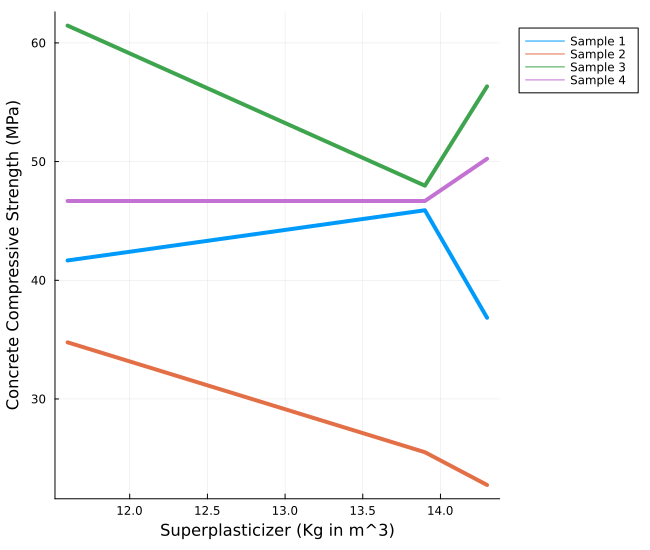

---
title: Predicting Compressive Strength of Concrete using Machine learning
lang: en-US
date-meta: '2022-10-31'
author-meta:
- Andrew Bushnell
- Kanchan Kulhalli
- Vikram Gadge
header-includes: |-
  <!--
  Manubot generated metadata rendered from header-includes-template.html.
  Suggest improvements at https://github.com/manubot/manubot/blob/main/manubot/process/header-includes-template.html
  -->
  <meta name="dc.format" content="text/html" />
  <meta name="dc.title" content="Predicting Compressive Strength of Concrete using Machine learning" />
  <meta name="citation_title" content="Predicting Compressive Strength of Concrete using Machine learning" />
  <meta property="og:title" content="Predicting Compressive Strength of Concrete using Machine learning" />
  <meta property="twitter:title" content="Predicting Compressive Strength of Concrete using Machine learning" />
  <meta name="dc.date" content="2022-10-31" />
  <meta name="citation_publication_date" content="2022-10-31" />
  <meta name="dc.language" content="en-US" />
  <meta name="citation_language" content="en-US" />
  <meta name="dc.relation.ispartof" content="Manubot" />
  <meta name="dc.publisher" content="Manubot" />
  <meta name="citation_journal_title" content="Manubot" />
  <meta name="citation_technical_report_institution" content="Manubot" />
  <meta name="citation_author" content="Andrew Bushnell" />
  <meta name="citation_author_institution" content="Department of CEE, University of Illinois" />
  <meta name="citation_author" content="Kanchan Kulhalli" />
  <meta name="citation_author_institution" content="Department of CEE, University of Illinois" />
  <meta name="citation_author" content="Vikram Gadge" />
  <meta name="citation_author_institution" content="Department of CEE, University of Illinois" />
  <link rel="canonical" href="https://uiceds.github.io/cee-492-term-project-fall-2022-avk/" />
  <meta property="og:url" content="https://uiceds.github.io/cee-492-term-project-fall-2022-avk/" />
  <meta property="twitter:url" content="https://uiceds.github.io/cee-492-term-project-fall-2022-avk/" />
  <meta name="citation_fulltext_html_url" content="https://uiceds.github.io/cee-492-term-project-fall-2022-avk/" />
  <meta name="citation_pdf_url" content="https://uiceds.github.io/cee-492-term-project-fall-2022-avk/manuscript.pdf" />
  <link rel="alternate" type="application/pdf" href="https://uiceds.github.io/cee-492-term-project-fall-2022-avk/manuscript.pdf" />
  <link rel="alternate" type="text/html" href="https://uiceds.github.io/cee-492-term-project-fall-2022-avk/v/bc7c90f8c9addf48054768995a892ac33537565d/" />
  <meta name="manubot_html_url_versioned" content="https://uiceds.github.io/cee-492-term-project-fall-2022-avk/v/bc7c90f8c9addf48054768995a892ac33537565d/" />
  <meta name="manubot_pdf_url_versioned" content="https://uiceds.github.io/cee-492-term-project-fall-2022-avk/v/bc7c90f8c9addf48054768995a892ac33537565d/manuscript.pdf" />
  <meta property="og:type" content="article" />
  <meta property="twitter:card" content="summary_large_image" />
  <link rel="icon" type="image/png" sizes="192x192" href="https://manubot.org/favicon-192x192.png" />
  <link rel="mask-icon" href="https://manubot.org/safari-pinned-tab.svg" color="#ad1457" />
  <meta name="theme-color" content="#ad1457" />
  <!-- end Manubot generated metadata -->
bibliography:
- content/manual-references.json
manubot-output-bibliography: output/references.json
manubot-output-citekeys: output/citations.tsv
manubot-requests-cache-path: ci/cache/requests-cache
manubot-clear-requests-cache: false
...


<!--

<small><em>
This manuscript
([permalink](https://uiceds.github.io/cee-492-term-project-fall-2022-avk/v/bc7c90f8c9addf48054768995a892ac33537565d/))
was automatically generated
from [uiceds/cee-492-term-project-fall-2022-avk@bc7c90f](https://github.com/uiceds/cee-492-term-project-fall-2022-avk/tree/bc7c90f8c9addf48054768995a892ac33537565d)
on October 31, 2022.
</em></small>
-->

## Authors


+ **Andrew Bushnell**<br>
    · {.inline_icon}
    [andrewb7777](https://github.com/andrewb7777)<br>
  <small>
     Department of CEE, University of Illinois
  </small>

+ **Kanchan Kulhalli**<br>
    · {.inline_icon}
    [Kanchan-uiuc](https://github.com/Kanchan-uiuc)<br>
  <small>
     Department of CEE, University of Illinois
  </small>

+ **Vikram Gadge**<br>
    · {.inline_icon}
    [vgadge2](https://github.com/vgadge2)<br>
  <small>
     Department of CEE, University of Illinois
  </small>


# Abstract

Using a data set covering the concrete compressive strength of a variety of different mixture components, we are going to create a machine learning program that will be able to predict when concrete failures will occur, which components and the combinations of these components will work best based on strength requirements of certain structures, and predict maximum allowable loads that can be achieved based on the mixtures.

This project aims at studying the behavior of various ingredients on the strength of concrete. 

Using these future trends, we will we be able to reach certain conclusions on the future improvements, designs, and materials that should be used in certain structures that we will be able to present to individuals in the fields that use these structures. They then can use these recommendations in their future projects. We will be using the data set of "Concrete Compressive Strength" which was obtained using Kaggle.com [@{https://www.kaggle.com/datasets/sinamhd9/concrete-comprehensive-strength}]. The data comes in the form of an excel file and We will compile all of the data into specific tables and use them to create the future trends we stated above.  

We will be creating new tables and figures that will be of comparisons of when the concrete fails vs the concrete material, strength of concrete vs water to cement ratio, concrete composition vs concrete strength, max allowable loads vs concrete material, max allowable loads vs concrete permutations. In future we will be adding cost of components as new dimension and check out what’s the best and minimal combination to make it cost effective and compare the cost and strength graph.
 
We intend to use Julia to compile these new tables using machine learning tools that can be used to predict permutations, concrete to water ratios etc, that are not specifically included within the data set so we can accurately predict these unknown values that can then be used to run theoretical tests in real life construction project scenarios.

# Exploratory Data Analysis

In this section, we aim to explain the various components in our dataset and it's effect on the concrete compressive strength.

The data set is composed of nine columns of data that state the following information: Fly Ash, Water, Superplasticizer, Coarse Aggregate, Age, and Concrete Compressive Strength. These columns have the following units of measurements: the first 7 columns have the units kg in m^3 mixture, 8th column in days and the 9th column in MPa megapascals. The data set[@{https://www.kaggle.com/datasets/sinamhd9/concrete-comprehensive-strength}] is in a CSV format and has a total of 1030 rows. We found a few discrepancies in the data set and we had to perform some data cleaning tasks before doing any exploratory analysis. The below section describes our data cleaning process in detail.

## Data Cleaning
The dataset that we selected from Kaggle comprised of rows that had rows that were repeated multiple times. In order to remove the redundancy, we used the `unique()` function to remove the duplicate rows. The number of rows reduced to 1005 after this operation.

The other issue we found out in our dataset was that the compressive strength was different despite all the factors affecting it i.e. all the 8 columns affecting it were exactly the same. We combined those rows in to a single row by taking a mean of the compressive strength. After this operation, the number of rows in our dataset reduced to 992.

We also observed that one of the columns i.e. fine aggregate had an extra space in it's name and we had to remove the extra space using the `rename()` method to make the column access easier.

```julia
begin
df_orig = CSV.read("/Users/kanchankulhalli/Documents/CEE 492 - Data Science/concrete_data.csv", DataFrame)
df_uniq = unique(df_orig)
rename!(df_uniq, :"fine_aggregate " => :fine_aggregate)
df_group = groupby(df_uniq, [:cement, :blast_furnace_slag, :fly_ash, :water, :superplasticizer, :coarse_aggregate, :fine_aggregate, :age])
df = combine(df_group, :concrete_compressive_strength => mean)
rename!(df, :concrete_compressive_strength_mean => :concrete_compressive_strength)
end
```


## Description of the Dataset

Now that we cleaned our dataset, we set out to ask some interesting questions and studying each column and its effect on concrete compressive strength but before we did that, we generated Table @tbl:table-1 to get a general understanding of the columns in our dataset.

|   |               variable              |  min  |   mean  |  median | max    |
|:-:|:-----------------------------------:|:-----:|:-------:|:-------:|--------|
|   |                Symbol               |  Real | Float64 | Float64 |  Real  |
| 1 | :cement(kg per m3)                  | 102.0 | 276.873 | 259.95  | 540.0  |
| 2 | :blast_furnace_slag(kg per m3)      | 1.0   | 73.0007 | 20.0    | 359.4  |
| 3 | :fly_ash(kg per m3)                 | 1.0   | 55.6028 | 1.0     | 200.1  |
| 4 | :water(kg per m3)                   | 121.8 | 182.368 | 185.7   | 247.0  |
| 5 | :superplasticizer(kg per m3)        | 1.0   | 6.34415 | 6.0     | 32.2   |
| 6 | :coarse_aggregate(kg per m3)        | 801.0 | 974.597 | 968.0   | 1145.0 |
| 7 | :fine_aggregate(kg per m3)          | 594.0 | 773.081 | 780.0   | 992.6  |
| 8 | :age(days)                          | 1     | 46.1663 | 28.0    | 365    |
| 9 | :concrete_compressive_strength(MPa) | 2.33  | 35.119  | 33.73   | 82.6   |

Table: Ranges and statistics of the columns in our dataset. {#tbl:table-1}

Water and Cement are the two most basic ingredients of concrete. The strength of the concrete mixture is heavily influenced by the proportions of these ingredients. We decided to take a look at how the water/cement ratio affects the strength of the concrete.

### Water and Cement
The Abrams’ water-to-cement ratio (w/c) pronouncement of 1918 has been described as the most useful and significant advancement in the history of concrete technology. His most important formulation was the inverse proportionality between the w/c ratio and the strength of concrete. The generally accepted Abrams rule is a formulation of the observation that an increase in the w/c decreases 

We decided to check how the Abrams' law holds up for our dataset considering the fact that there are several other ingredients that affect the strength of the concrete. Figure @fig:plot-1 plots the water cement ratio versus the concrete compressive strength. 


{#fig:plot-1}

We can observe that the law holds quite good from a general perspective i.e. the compressive strengths decreases with the increase in the w/c ratio but doesn't hold true on a case by case basis. This is understandable since there are a number of other factors that also influnce the strength.

In the below sub sections, we try to analyze the effects of various other ingredients on the compressive strength of concrete.

### Superplasticizer
Superplasticizers are powerful water reducers that enable an increase in the ultimate stress of concrete by decreasing the w/c ratio, a decrease in the cement content while maintaining the same range of strength or workability, an increase in concrete compacity, and other effects.[@{https://www.sciencedirect.com/science/article/pii/S0958946512001369}]

An important component of most modern concrete mixes, water reducers improve the workability of wet concrete while decreasing the amount of water used in the mix. Superplasticizers decrease the water-cement ratio while providing such benefits as increased density and improved bond strength.

{#fig:plot-2}

In order to study the effect of superplasticizer alone, we kept all the other columns constant and compared the varying superplasticizer with the concrete compressive strength. Figure @fig:plot-2 shows the line plots for different samples. It is not clear how the superplasticizer is affecting the strength. We looked through a number of articles and research papers and we found out that the effect of superplasticizers are more pronounced when the ratio of superplasticizer to cement is between 0.5% to 3% [@{http://www.buildingresearch.com.np/newfeatures.php}]. To verify this, we plotted Figure @fig:plot-3 with two samples, the first one has a superplasticizer/cement(s/c) ratio equal to 0.2% and the second one has s/c ratio equal to 2%.

{#fig:plot-3 height=2.5in}

We can see that a decrease in the superplasticizer to water ratio results in decrease in the concrete compressive strength. This suggests a positive correlation between the superplasticizer and the concrete strength. However for ratios greater than 3%, we did not find any kind of correlation between these two suggesting that the effect of superplasticizer depends on the s/c ratio.


### Fly Ash

In recent decades, fly ash has become an increasing common component used in concrete mixtures. Fly ash is used to increase the workability of plastic concretes along with increase the strength and durability of regular concretes (Ondova, 2012). Fly ash can also be used to  replace a portion of the amount of the cement mixture needed. This in return reduces the cost while not decreasing the strength. Using our data set we first began by organizing the data set to only include unique values of fly ash since there were many rows that had no fly ash component in their concrete mixture. Then using this data set, we created a histogram to show the general trendline of the imapct that the fly ash component has on the compressive strength. We see that using fly ash does increase the strength of the concrete but peaks at approximately 20 kg per m^3 mixture and then decreases as more fly ash is used. This is mostly due to fly ash not being suitable to replace fully or the majority of the cement used in the mixture and is used more as a binding unit that helps with the workability and durability to a certain degree [@doi:10.1016/j.proeng.2012.07.582].

{#fig:plot-4 height=2in}


### Coarse Aggregate and Fine aggregate
Aggregates are inert granular materials such as sand, gravel, or crushed stone that, along with water and portland cement, are an essential ingredient in concrete. Fine aggregates generally consist of natural sand or crushed stone with most particles passing through a 3/8-inch sieve. Coarse aggregates are any particles greater than 0.19 inch, but generally range between 3/8 and 1.5 inches in diameter. Gravels constitute the majority of coarse aggregate used in concrete with crushed stone making up most of the remainder
[@{https://www.cement.org/cement-concrete/concrete-materials/aggregates}].


{#fig:plot-5 height=5in}

We can observe from Figure @fig:plot-5 that there is no positive correlation between the coarse aggregate and the concrete compressive strength. We couldn't really understand how to interpret the graph. It's possible that it's effects weren't pronounced in the samples that we have taken. It is clear that we need a more refined model to understand the effects of this property.

{#fig:plot-6 height=6in}
Figure @fig:plot-6 shows a positive correlation between the fine aggregate and the concrete compressive strength which is quite intuitive.

For both the graphs, we have kept all the columns constant except for the column that we are analyzing.


### Age
By creating a histogram plot of Concrete Compressive Strength vs Age where age is the number of days after the concrete has been placed, we see that as concrete age increases the compressive strength increases until it reaches a peak at approximately 28 days and then gradually decreases in strength as age increases due to wear and tear of the concrete material. Looking online we see that concrete requires a curing time where once the concrete is placed it needs time to cure which is where the water content in the concrete mixture evaporates, leading to the concrete to settle and harden (Kim 1998). This in return leads to the strength to increase. Based on this information and looking at the data set, to have the concrete mixture to result in the strongest compressive strength we want our age to be around the 28 day mark which is the ideal curing time.
{#fig:plot-7 height=3in}


### Blast Furnace Slag

Concretes containing slag as a partial replacement of cement (up to 40%) had higher compressive and flexural strengths casting and curing at +42°C than those of concretes made with Portland cement alone[@doi:10.1016/j.jare.2011.03.004].

{#fig:plot-8}

Figure @fig:plot-8 shows a negative correlation where the compressive strength of the concrete is decreasing with the increase in the Blast furnace slag content.


### Concrete Compressive Strength

{#fig:plot-9}

The graph above explains how the proportions of the 8 components are affecting the concrete compressive strength. It clearly shows that the second bar graph has more quantity of superplasticizer and less quantity of water than the first bar graph. Also, the second bar graph has good aging time than the first one. Hence clearly the second plot has more concrete compressive strength than the first one.


# Predictive Modeling
Using our data set we can create a machine learning program code to produce a predictive modeling code for solving for which combinations of concrete mixtures would be ideal to meet a certain strength requirement, based on different construction projects, and then find the minimum optimal cost. To do this we intend to first use the data available in our dataset to find out the unit costs of each component in our concrete. We then will look up research papers over the different strength requirements set in place at the State and Federal level for different construction projects, such as bridges and highways where highway bridges require a minimum of 25 MPa to pass the strength requirements set in place in California [@doi:10.1061/(ASCE)CF.1943-5509.0000404]. We then will design a machine learning program that will take our data available and create rough estimations of how much of each concrete component would need to be used to create the optimal combination for each project. This would be done through the creation of a model of ideal solutions to meet the lowest price and still meet the strength requirements for each unique project. This would be very useful in the construction industry which would be able to use our machine learning program to evaluate which combination of concrete would best work to meet the requirements of their project while also saving the construction company the most capital. Based on what we have discussed with the TA, this is a feasible idea since our data could be used to create combinations that are not currently in our dataset by using what we learned in class to create rough estimates of new combinations based on the current data. For example we could find the new compressive strength of a certain new combination to be the average strength of two known combinations from our data set or use certain criteria found online, such as impact of water to cement ratio or fly ash to concrete ratio, to make a rough estimate of the new combinations results compressive strength. We intend to do this by creating something similar to the solver function in excel where we will have an objective function, such as minimize price and maximize strength, and set up constraints, such as have strength be greater than or equal to 25 MPa or have at least 20% cement. Then solving this would give us our end result of a new matrix of the ideal values for the combinations in the concrete to be used for that specific project.


## References {.page_break_before}

<!-- Explicitly insert bibliography here -->
<div id="refs"></div>
