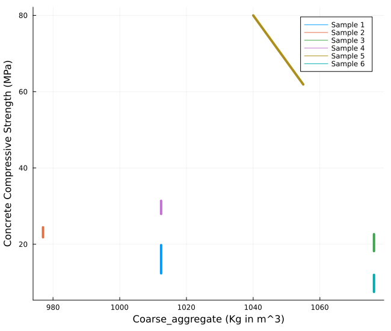
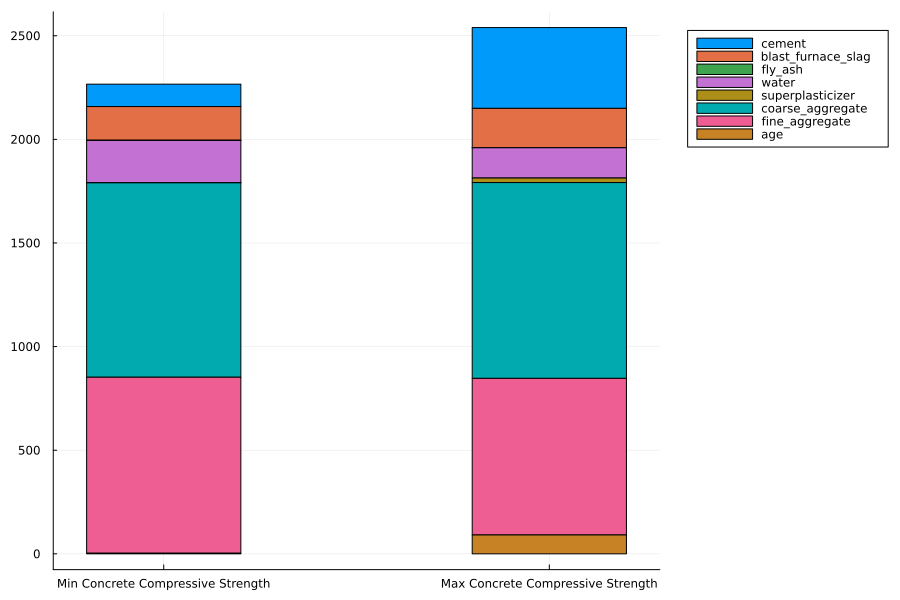

---
title: Predicting Compressive Strength of Concrete using Machine learning
lang: en-US
date-meta: '2022-12-09'
author-meta:
- Andrew Bushnell
- Kanchan Kulhalli
- Vikram Gadge
header-includes: |-
  <!--
  Manubot generated metadata rendered from header-includes-template.html.
  Suggest improvements at https://github.com/manubot/manubot/blob/main/manubot/process/header-includes-template.html
  -->
  <meta name="dc.format" content="text/html" />
  <meta name="dc.title" content="Predicting Compressive Strength of Concrete using Machine learning" />
  <meta name="citation_title" content="Predicting Compressive Strength of Concrete using Machine learning" />
  <meta property="og:title" content="Predicting Compressive Strength of Concrete using Machine learning" />
  <meta property="twitter:title" content="Predicting Compressive Strength of Concrete using Machine learning" />
  <meta name="dc.date" content="2022-12-09" />
  <meta name="citation_publication_date" content="2022-12-09" />
  <meta name="dc.language" content="en-US" />
  <meta name="citation_language" content="en-US" />
  <meta name="dc.relation.ispartof" content="Manubot" />
  <meta name="dc.publisher" content="Manubot" />
  <meta name="citation_journal_title" content="Manubot" />
  <meta name="citation_technical_report_institution" content="Manubot" />
  <meta name="citation_author" content="Andrew Bushnell" />
  <meta name="citation_author_institution" content="Department of CEE, University of Illinois" />
  <meta name="citation_author" content="Kanchan Kulhalli" />
  <meta name="citation_author_institution" content="Department of CEE, University of Illinois" />
  <meta name="citation_author" content="Vikram Gadge" />
  <meta name="citation_author_institution" content="Department of CEE, University of Illinois" />
  <link rel="canonical" href="https://uiceds.github.io/cee-492-term-project-fall-2022-avk/" />
  <meta property="og:url" content="https://uiceds.github.io/cee-492-term-project-fall-2022-avk/" />
  <meta property="twitter:url" content="https://uiceds.github.io/cee-492-term-project-fall-2022-avk/" />
  <meta name="citation_fulltext_html_url" content="https://uiceds.github.io/cee-492-term-project-fall-2022-avk/" />
  <meta name="citation_pdf_url" content="https://uiceds.github.io/cee-492-term-project-fall-2022-avk/manuscript.pdf" />
  <link rel="alternate" type="application/pdf" href="https://uiceds.github.io/cee-492-term-project-fall-2022-avk/manuscript.pdf" />
  <link rel="alternate" type="text/html" href="https://uiceds.github.io/cee-492-term-project-fall-2022-avk/v/c36ac0ddfb2aa8dc3e3207dc5a3b4b9b7cb22a3f/" />
  <meta name="manubot_html_url_versioned" content="https://uiceds.github.io/cee-492-term-project-fall-2022-avk/v/c36ac0ddfb2aa8dc3e3207dc5a3b4b9b7cb22a3f/" />
  <meta name="manubot_pdf_url_versioned" content="https://uiceds.github.io/cee-492-term-project-fall-2022-avk/v/c36ac0ddfb2aa8dc3e3207dc5a3b4b9b7cb22a3f/manuscript.pdf" />
  <meta property="og:type" content="article" />
  <meta property="twitter:card" content="summary_large_image" />
  <link rel="icon" type="image/png" sizes="192x192" href="https://manubot.org/favicon-192x192.png" />
  <link rel="mask-icon" href="https://manubot.org/safari-pinned-tab.svg" color="#ad1457" />
  <meta name="theme-color" content="#ad1457" />
  <!-- end Manubot generated metadata -->
bibliography:
- content/manual-references.json
manubot-output-bibliography: output/references.json
manubot-output-citekeys: output/citations.tsv
manubot-requests-cache-path: ci/cache/requests-cache
manubot-clear-requests-cache: false
...


<!--

<small><em>
This manuscript
([permalink](https://uiceds.github.io/cee-492-term-project-fall-2022-avk/v/c36ac0ddfb2aa8dc3e3207dc5a3b4b9b7cb22a3f/))
was automatically generated
from [uiceds/cee-492-term-project-fall-2022-avk@c36ac0d](https://github.com/uiceds/cee-492-term-project-fall-2022-avk/tree/c36ac0ddfb2aa8dc3e3207dc5a3b4b9b7cb22a3f)
on December 9, 2022.
</em></small>
-->

## Authors


+ **Andrew Bushnell**<br>
    · {.inline_icon}
    [andrewb7777](https://github.com/andrewb7777)<br>
  <small>
     Department of CEE, University of Illinois
  </small>

+ **Kanchan Kulhalli**<br>
    · {.inline_icon}
    [Kanchan-uiuc](https://github.com/Kanchan-uiuc)<br>
  <small>
     Department of CEE, University of Illinois
  </small>

+ **Vikram Gadge**<br>
    · {.inline_icon}
    [vgadge2](https://github.com/vgadge2)<br>
  <small>
     Department of CEE, University of Illinois
  </small>


# Report Rough Draft

## Introduction

Our project aim is to create a machine-learning model to predict which components and the combinations of these components in our data set can give the best possible concrete compressive strength. The general research question is whether a machine-learning model can predict the best admixture for a construction project. Finding the best combination of concrete components to achieve the highest concrete compressive strength is a vital part of the construction field since, as a company, one always wants to meet the project requirements and make the most profit. Work done by other researchers in this area concentrates mainly on creating machine learning programs to estimate the ideal cost for a project based on the materials/labour that are required. However, we want to focus on concrete admixtures and create a machine-learning model to determine the ideal admixtures of different projects.

## Exploratory analysis

For our exploratory analysis, we aimed to explain our data set's various components and their effect on the concrete compressive strength.

The data set we chose comprises nine columns of independent components that state the following information: Fly Ash, Water, Superplasticizer, Coarse Aggregate, Age, and Concrete Compressive Strength. These columns have the following units of measurement: the first seven columns have the units kg in m^3 mixture, the eighth column in days and the ninth column in MPa megapascals. The data set[@{https://www.kaggle.com/data-sets/sinamhd9/concrete-comprehensive-strength}] is in a CSV format and has 1030 rows. We found a few discrepancies in the data set, so we had to perform some data-cleaning tasks before doing any exploratory analysis. The below section describes our data-cleaning process in detail.

### Data Cleaning

The data set that we selected from Kaggle comprised rows that repeated multiple times. To remove the redundancy, we used the `unique()` function to remove the duplicate rows. The number of rows was reduced to 1005 after this operation.

The other issue in our data set was that the compressive strength was different despite all the factors affecting it, i.e., all eight columns were the same. We combined those rows into a single row by taking a mean of the compressive strength. After this operation, the number of rows in our data set was reduced to 992.

We also observed that one of the columns, i.e., fine aggregate had an extra space in its name, and we had to remove the extra space using the `rename()` method to make the column access easier.


```julia
begin
df_orig = CSV.read("/Users/kanchankulhalli/Documents/CEE 492 - Data Science/concrete_data.csv", DataFrame)
df_uniq = unique(df_orig)
rename!(df_uniq, :"fine_aggregate " => :fine_aggregate)
df_group = groupby(df_uniq, [:cement, :blast_furnace_slag, :fly_ash, :water, :superplasticizer, :coarse_aggregate, :fine_aggregate, :age])
df = combine(df_group, :concrete_compressive_strength => mean)
rename!(df, :concrete_compressive_strength_mean => :concrete_compressive_strength)
end
```
Now that we cleaned our data set, we set out to ask some interesting questions by studying each column and its effect on concrete compressive strength. However, before that, we generated Table @tbl:table-1 to understand the columns in our data set.

|   |               variable              |  min  |   mean  |  median | max    |
|:-:|:-----------------------------------:|:-----:|:-------:|:-------:|--------|
|   |                Symbol               |  Real | Float64 | Float64 |  Real  |
| 1 | :cement(kg per m3)                  | 102.0 | 276.873 | 259.95  | 540.0  |
| 2 | :blast_furnace_slag(kg per m3)      | 1.0   | 73.0007 | 20.0    | 359.4  |
| 3 | :fly_ash(kg per m3)                 | 1.0   | 55.6028 | 1.0     | 200.1  |
| 4 | :water(kg per m3)                   | 121.8 | 182.368 | 185.7   | 247.0  |
| 5 | :superplasticizer(kg per m3)        | 1.0   | 6.34415 | 6.0     | 32.2   |
| 6 | :coarse_aggregate(kg per m3)        | 801.0 | 974.597 | 968.0   | 1145.0 |
| 7 | :fine_aggregate(kg per m3)          | 594.0 | 773.081 | 780.0   | 992.6  |
| 8 | :age(days)                          | 1     | 46.1663 | 28.0    | 365    |
| 9 | :concrete_compressive_strength(MPa) | 2.33  | 35.119  | 33.73   | 82.6   |

Table: Ranges and statistics of the columns in our dataset. {#tbl:table-1 height=2in}

Water and Cement are the two most essential ingredients of concrete. The proportions of these ingredients heavily influence the strength of the concrete mixture. We decided to look at how the water/cement ratio affects the strength of the concrete.

### Water and Cement
Abram's water-to-cement ratio (w/c) pronouncement of 1918 is the most valuable and significant advancement in the history of concrete technology. The generally accepted Abrams rule is a formulation of the observation that an increase in the w/c decreases the strength [@{https://www.researchgate.net/publication/222447231_Modeling_of_Strength_of_High-Performance_Concrete_Using_Artificial_Neural_Networks_Cement_and_Concrete_research_2812_1797-1808}].

We decided to check how Abrams' law holds up for our data set, considering that several other ingredients affect the strength of the concrete. Figure @fig:plot-1 plots the water-cement ratio versus the concrete compressive strength. 

{#fig:plot-1 height=2.5in}

The law holds quite well from a general perspective, i.e., the compressive strength decreases with the increase in the w/c ratio but does not hold on a case-by-case basis. This result is understandable since several factors also influence strength.

In the below sub-sections, we analyze the effects of various other ingredients on the compressive strength of concrete.

### Superplasticizer
Superplasticizers are powerful water reducers that increase concrete strength by decreasing the w/c ratio [@{https://www.sciencedirect.com/science/article/pii/S0958946512001369}].

An essential component of most modern concrete mixes, water reducers improve the workability of wet concrete while decreasing the amount of water used in the mix. Superplasticizers decrease the water-cement ratio while providing such benefits as increased density and improved bond strength.

{#fig:plot-2 height=2.5in}

To study the effect of the superplasticizer in isolation, we kept all the other columns constant, i.e., by filtering out rows which were the same except for the values of Superplasticizer and Concrete compressive strengths. A comparison of the varying superplasticizer content with the concrete compressive strength is drawn. Figure @fig:plot-2 shows the line plots for different samples. It needs to be clear how the superplasticizer is affecting the strength. We looked through several articles and research papers and found out that the effect of superplasticizers is more pronounced when the ratio of superplasticizer-to-cement is between 0.5% to 3% [@{http://www buildingresearch.com.np/newfeatures.php}]. To verify this, we plotted Figure @fig:plot-3 with two samples, the first one has a superplasticizer/cement(s/c) ratio equal to 0.2%, and the second one has an s/c ratio equal to 2%.

{#fig:plot-3 height=2.5in}

We can see that a decrease in the superplasticizer-to-water ratio decreases the concrete compressive strength. This analysis suggests a positive correlation between the superplasticizer and the concrete strength. However, for ratios greater than 3%, we did not find any correlation between these two suggesting that the effect of superplasticizer depends on the s/c ratio.

### Fly Ash

Fly ash has become increasingly common in concrete mixtures in recent decades. Fly ash increases the workability of plastic concretes and the strength and durability of regular concretes [@doi:10.1016/j.proeng.2012.07.582]. Fly ash is used to replace a portion of the cement mixture needed. In return, it reduces the cost while not decreasing the strength. 

Using our data set, we began by organizing it only to include unique values of fly ash since many rows had no fly ash component in their concrete mixture. Then using this data set, we created a histogram to show the general trendline of the impact of the fly ash component on the compressive strength. We can see from Figure @fig:plot-4 that using fly ash does increase the strength of the concrete but peaks at approximately 20 kg per m^3 mixture, and a further increase in fly ash only decreases the strength of the concrete. This result is mainly due to fly ash not being suitable to replace fully or most of the Cement used in the mixture and is used more as a binding unit that helps with the workability and durability to a certain degree.

{#fig:plot-4 height=2.5in}

### Coarse Aggregate and Fine Aggregate
Aggregates are inert granular materials such as sand, gravel, or crushed stone that, along with water and Portland cement, are essential ingredients in concrete. Fine aggregates generally consist of natural sand or crushed stone, with most particles passing through a 3/8-inch sieve. Coarse aggregates are particles greater than 0.19 inches but generally range between 3/8 and 1.5 inches in diameter [@{https://www.cement.org/cement-concrete/concrete-materials/aggregates}].

{#fig:plot-5 height=2.5in}

We can observe from Figure @fig:plot-5 that there is no positive correlation between the coarse aggregate and the concrete compressive strength. We needed help understanding how to interpret the graph. Its effects are not evident in the samples that we took. We need a more refined model to understand the effects of this property.

{#fig:plot-6 height=2.5in}

Figure @fig:plot-6 shows a positive correlation between the fine aggregate and the concrete compressive strength, as expected. For both graphs, we have kept all the columns constant except for the column we are analyzing.

### Age

{#fig:plot-7 height=2.5in}

Figure @fig:plot-7 shows a histogram plot of Age vs Concrete Compressive Strength where age is the number of days after the concrete pouring. We see that as concrete age increases, the compressive strength increases until it reaches a peak at approximately 28 days and then gradually decreases in strength as age increases due to wear and tear of the concrete material. From [@{https://www.sciencedirect.com/science/article/abs/pii/S0008884698001641?via%3Dihub}], we understood that the concrete requires a curing time where once the concrete pouring is done, it needs time to cure, which is where the water content in the concrete mixture evaporates, leading to the concrete to settle and harden. In return leads to an increase in the concrete compressive strength. Based on this information, we want our age to be around the 28-day mark to achieve robust compressive strength, which is the ideal curing time.

### Blast Furnace Slag

Concretes containing slag as a partial replacement of Cement (up to 40%) had higher compressive and flexural strengths casting and curing at +42°C than concretes made with Portland cement alone[@doi:10.1016/j.jare.2011.03.004].

{#fig:plot-8 height=2.5in}

However, Figure @fig:plot-8 shows a negative correlation where the compressive strength of the concrete decreases with the increase in the Blast furnace slag content. We could not figure out how to interpret this graph, similar to the case we explained for coarse aggregate.

### Concrete Compressive Strength

{#fig:plot-9 height=2.5in}

The graph above explains how the eight components' proportions affect the concrete compressive strength. It clearly shows that the second bar graph has more superplasticizer quantity and less water quantity than the first bar graph. Also, the second bar graph has good ageing time than the first one. Hence, the second plot has more concrete compressive strength than the first one.

# Predictive Modeling
Using our data set, we can create a machine learning model to predict which combinations of concrete mixtures would be ideal to meet a specific strength requirement based on different construction projects.

We plan to use regression analysis as a first step towards creating a feasible model. We have eight independent variables (the eight columns described in the previous section) affecting the single dependent variable: the concrete compressive strength. We plan to explore more advanced machine learning models depending on the model's results. We will create rough estimations of how much of each concrete component would need to be used to create the optimal combination for each project. This model would be advantageous in the construction industry, which would be able to use our machine learning models to evaluate which combination of concrete would best work to meet their project requirements while saving the construction company the most capital.

# Preliminary Predictive Modeling

This section will explore multiple methods of creating machine-learning models to predict concrete compressive strengths for different combinations of components. We developed a linear regression model, which would be our base model. We have further implemented the decision tree model, which significantly improves accuracy.

### Regression

Our dataset consists of eight independent variables and one dependent variable. We want to know how each of these independent variables affects the dependent variable, i.e. concrete compressive strength. To begin with, we checked if these independent variables affect the concrete strength linearly by implementing a simple linear regression model.

We first divided our data into two sets (i) training data set and (ii) testing data set. The training data set consists of 750 rows, and the testing dataset consists of 242. So, we split our dataset into training and testing to about 75% and 25% roughly. We did not split our data set into evaluation dataset since the number of hyperparameters to be tuned for this model were only a few. We set our learning rate to 0.1 and the number of steps to 1000. These hyperparameters are needed for finding the global minima for our cost function, which is the mean squared error in our case. We did tune our hyperparameters a bit. However, we were still waiting for a noticeable improvement in the results. 

Here is a snippet of our model.

```julia
# Linear regression model -> Y = beta.X + C
function minimize!(f_model::Function, x::Matrix{T}, y::Vector{T}, p::Vector{T}, η::T, num_steps::Int)::Vector{T} where T<:AbstractFloat
    f(p) = mse(f_model(x,p),y)
    for i in 1:num_steps
        g = f'(p)
        p -= η * g 
    end
    p
end

function model(x::Matrix{T}, p::Vector{T})::Vector{T} where T<:AbstractFloat
    p1 = p[1:end-1]
    p2 = p[end]
    ŷ = x * p1 .+ p2
end

# Train the model on df_train ~ 750 rows and learn the model parameters beta.
T = Matrix(normalize_df(df_train))
beta = minimize!(model, T, y_train, rand(size(T)[2]+1), 0.1, 1000)

# Use the model parameters(beta) to predict the concrete compressive strength(y_hat)
input_data = Matrix(normalize_df(df_test))
y_hat = model(input_data, beta)

# Calculate the RMSE on the test data.
sqrt(mse(y_hat, y_test))

```

{#fig:linear-reg height=5in}

We got an RMSE of ~ 10 for the testing dataset. The error for both the testing and training dataset is almost the same. From Figure @fig:linear-reg, we can see that although many points are closer to the 45-degree line, we can also see a large number of points deviate from the line quite a bit. This trend can suggest a few things.

* The model has overfitted on the training data and is performing poorly on the testing data.
* The dependency of the independent variables cannot be modelled linearly; hence, we may need a more complex model like a neural network.
* Our dataset comprises only eight variables that affect the concrete compressive strength. Many other factors may affect the strength, which is a limitation of the dataset. From [@{https://theconstructor.org/concrete/factors-affecting-strength-of-concrete/6220/}], we can see that the compressive strength of the concrete also depends on temperature, humidity and curing, among many other factors.

To follow this up, we implemented a logistic regression model and the multilayered regression model (neural network) to see if we could make any significant improvements. However, we found an RMSE of around 34 for both models' testing data. This result was surprising since we expected the non-linear models to perform better. Hence, we decided not to plot them. 

### Regression Conclusions

* To understand why our linear regression model performs poorly, we checked if we overfitted the model on the training data. However, the RMSE on the training and testing data are almost the same; hence we have kept the model manageable.
* We will continue to explore why our neural network models performed so poorly and hope we can find a convincing answer by the next deadline. One of the plausible reasons could be that we still need to do regularization. Although we realized that our model had not been overfitted, it would be a good idea to try this out in the future.
* We could implement a stochastic gradient descent algorithm and verify if that improves our model.

### Decision Tree

Following our regression model, we tried using the decision tree method in Julia to create a predictive model of our data using a regression tree made out of our data since our dataset is considered non-linear. To start, we split our cleaned data into independent variables (the concrete admixtures, XXX) and dependent variables (the concrete compressive strength, XX). This data would be in the form of a matrix and vector, so they can then be used to create our decision tree.

```julia
  independent = Matrix(XXX),
  dependent = vec(Matrix(XX))
```
We then would build our initial tree using our independent and dependent variables using the following code available in the DecisionTree package from Julia.

```julia
init_tree = build_tree(dependent, independent)
```
After our initial tree was created, we tried using the print_tree function to visualize what our initial tree looked like in terms of values, as seen below. However, this returned only the tree in numerical form, making it hard to visualize. 

```julia
print_tree(init_tree)
```
We researched online how to plot the decision tree and used the "EvoTrees", "MLJ", and "MLJModels" packages in Julia. That led to us being able to produce the following plot, our initial decision tree that used our unaltered independent and dependent variables from our dataset.

```julia
config = EvoTreeRegressor(
    loss=:linear, 
    nrounds=100, 
    nbins=100,
    lambda=0.5, 
    gamma=0.1, 
    eta=0.1,
    max_depth=6, 
    min_weight=1.0,
    rowsample=0.5, 
    colsample=1.0)
    x_train = independent
    y_train = dependent
mmm = fit_evotree(config; x_train, y_train)
Unaltered = Plots.plot(mmm,2, size=(1800,1800))
```
Using the code above, we were able to plot our initial decision tree, as seen below, successfully.

{#fig:plot-10 height=5in}

We then used the following code, which ran a cross-validation of the inputs we were using based on the number of n-folds we had chosen. We chose 5 for our data set since using more than this did not change the accuracy, and using less than this lowered the accuracy. All the other variables used in this function we set as the default values the function used since only changing the pruning purity affected the accuracy. However, changing the value only lowered the accuracy since it could only be a value from 0 to 1 and having a value of 1 seemingly gave the highest accuracy.

```julia
n_folds = 5
n_subfeatures = 0; max_depth = -1; min_samples_leaf = 10
min_samples_split = 2; min_purity_increase = 0.0; pruning_purity = 1.0 ; seed=3
accuracyy= nfoldCV_tree(dependent, independent, n_folds, pruning_purity, max_depth, min_samples_leaf, min_samples_split, min_purity_increase; verbose = true, rng = seed) 

output = 
Mean Coeff of Determination: 0.7863928687545627
5-element Vector{Float64}:
 0.8169979801378208
 0.817157085939846
 0.7354379123502578
 0.8112046184837071
 0.7511667468611821
```
The average accuracy of our initial decision tree's testing data is 78.6%. To increase the accuracy, we ran our independent and dependent variables through another build tree function but now use the default sub_features we used in our "accuracy" function from earlier. We then take this new decision tree and run it through the "apply_tree" function to create a new vector of our dependent variables. Which we then can use to compare to our initial dependent variables vector. Then we can check this accuracy with our new dependent variable vector compared to our original, and we see that we now have an average accuracy of 90.9% over the testing data.

```julia
new_init_tree = build_tree(dependent, independent, n_subfeatures, max_depth, min_samples_leaf, min_samples_split, min_purity_increase; rng = seed)

new_dependent_vector = apply_tree(mnn, independent)

accuracyyy= nfoldCV_tree(new_dependent_vector, independent, n_folds, pruning_purity, max_depth, min_samples_leaf, min_samples_split, min_purity_increase; verbose = true, rng = seed) 

output = 
Mean Coeff of Determination: 0.9094893339292118
5-element Vector{Float64}:
 0.9242267026779262
 0.911504737742548
 0.8489222674442972
 0.9591954741485458
 0.9035974876327418
```
We then plotted this new decision tree the same way we did for the first one, producing the following.

{#fig:plot-11 height=5in}

After running it through the decision trees algorithm, we made the following scatter plot to see how the original dependent variables vector and the new dependent variables vector compare. The best-fit line fits approximately 75% of the points on the plot seen below.

{#fig:plot-12 height=5in}

Lastly, we can see how the Gini impurity has changed after running our dependent variable vector through the decision tree. They are close to the same value, which means that our decision trees above are very similar. Our machine learning made an accurate prediction.

```julia

function gini_impurity(y::AbstractVector)
    ig = 1.0
    println(y)
    u = unique(y)
    for c in u 
        p = mean(c .== y)^2
        ig -= p
    end

gini_impurity(sw)
gini_impurity(dependent)

output =
0.9865130723205006
0.9986078141259189
```
### Decision Tree Conclusions

The decision tree method overall was a viable option to create a draft predictive model for our data set, and we intend to refine our trees to be used later on. We can improve our decision tree method by finding a way to prune the decision tree more effectively or to split our dataset better to achieve higher accuracy. We could also refine our Gini impurity so that the data set has less inequality.

## Discussion 

After creating two machine learning models of our data set in our predictive modelling section, we concluded that our initial research question could be accomplished with relative accuracy. However, our initial idea of how our machine learning program would work was very different from what we had initially in mind. We decided to insert a constraint, such as 20 MPa, for the concrete compressive strength, which would give us the admixture combination that came close to this. However, since our data set was only composed of a category of admixtures, we needed help to get it to return one value. Instead, it would return many rows of data. The next step we could take is to find a better dataset for this topic we chose or create our dataset that provided the exact impacts that each concrete component contributed to the concrete's compressive strength. We could then use this new data set we created and normalize, run through dense layers, and use neural network programming to create a much better predictive model that could be applied in real-world, concrete management projects.


## References {.page_break_before}

<!-- Explicitly insert bibliography here -->
<div id="refs"></div>
